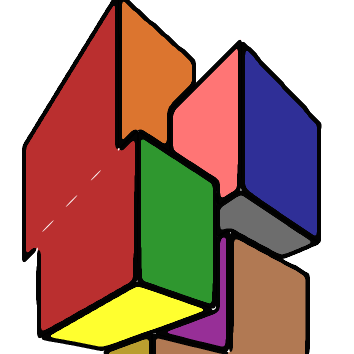

# Contribute

The project is open source and under MIT license. You can contribute by cloning the [Github repo](https://github.com/calba5141114/helpmepoc) and adding to the list, or by providing translations of the docs into different languages.

## Our wonderful contributors

## Sponsor Us

Coming soon!
